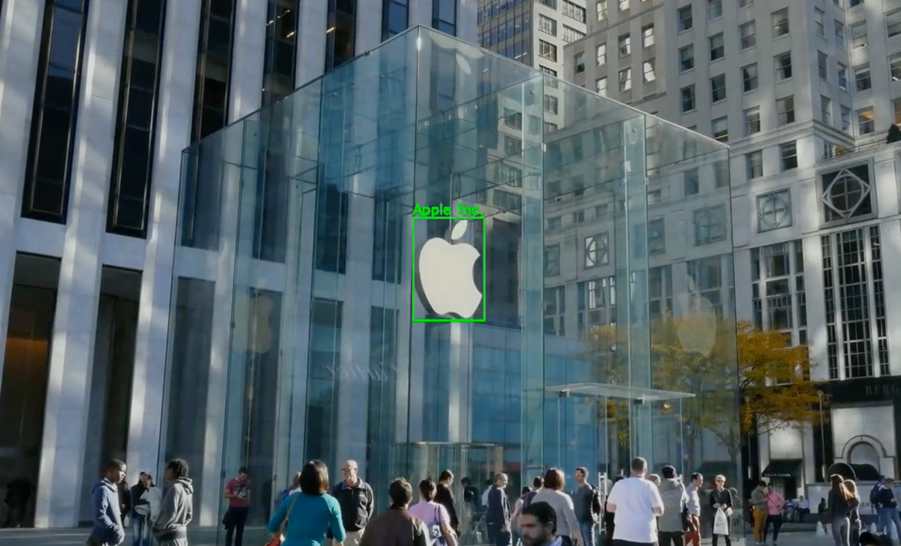

## Drawing Logos and Text on video from response of Vision API
 Drawing bounding boxes on video using Google Vision API, Remember, Google doesn't return result in form of a json file, you will have to save it in json format using code below.

    result = operation.result(timeout=90)

    MessageToDict(result._pb)

* Install requirements using "pip install -r requirement.txt".
* Give path of json and source video in the code, better to make seprate folders and palce files.
* At the moment the code only supports text and logo so select logo or text in the code.

* run the file draw_bbox.py using "python draw_bbox.py"

### Source Image

### Result Image Logo
